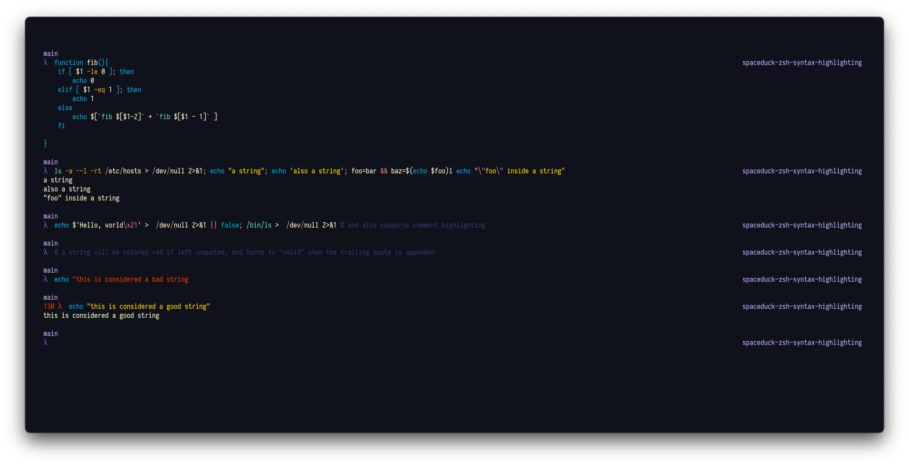

# Spaceduck for [zsh-syntax-highlighting](https://github.com/zsh-users/zsh-syntax-highlighting)

> A [spaceduck](https://github.com/pineapplegiant/spaceduck) theme for [zsh-syntax-highlighting](https://github.com/zsh-users/zsh-syntax-highlighting)




## Install

First, get the source code via one of the download methods, then proceed to activating.

### Getting Theme
#### Download using Git

If you are a git user, you can install the theme and keep up to date by cloning the repo:

```bash
git clone git@github.com:bigpick/spaceduck-zsh-syntax-highlighting.git
```

#### Download manually

Download using the [GitHub .zip download](https://github.com/bigpick/spaceduck-colorls/archive/main.zip) option and unzip them.

### Activating theme

1. First you need to have installed and switched to using [ZSH](https://github.com/ohmyzsh/ohmyzsh/wiki/Installing-ZSH). 
2. Then, you need to have installed the ["fish shell-like syntax highlighting for ZSH", zsh-syntax-highlighting](https://github.com/zsh-users/zsh-syntax-highlighting).
    * Just follow the [installation](https://github.com/zsh-users/zsh-syntax-highlighting/blob/master/INSTALL.md) steps for install.
3. Add this theme's relevant settings to your `~/.zshrc`.
    * Copy the contents of the [spaceduck_zsh_syntax_highlighting.bash](https://github.com/bigpick/spaceduck-zsh-syntax-highlighting/blob/main/spaceduck_zsh_syntax_highlighting.bash) file, and paste into your zshrc file at `~/.zshrc`:
        
        ```bash
        # cat + copy
        cat ./spaceduck_zsh_syntax_highlighting.bash # | pbcopy (if on macOS)
        vim ~/.zshrc 
        # paste before you activate the zsh-syntax-highlighting, see note below
        ```
    * **Note**: If you installed zsh-syntax-highlighting [via git](https://github.com/zsh-users/zsh-syntax-highlighting/blob/master/INSTALL.md#in-your-zshrc), or [site wide](https://github.com/zsh-users/zsh-syntax-highlighting/blob/master/INSTALL.md#system-wide-installation), be sure to paste the contents of the file _before_ the following line in your `~/.zshrc` file:

      ```bash
      # which looks something like so:
      source ...zsh-syntax-highlighting/zsh-syntax-highlighting.zsh
      ```

   * **Note**: If you installed zsh-syntax-highlighting [via a plugin manager](https://github.com/zsh-users/zsh-syntax-highlighting/blob/master/INSTALL.md#with-a-plugin-manager), be sure to paste the contents of the file _before_ you activate the utility via it's plugin invocation.

4. Start a new zsh session:

    ```bash
    exec zsh
    ```

    ... and confirm it's working.

## License

[MIT License](./LICENSE)
